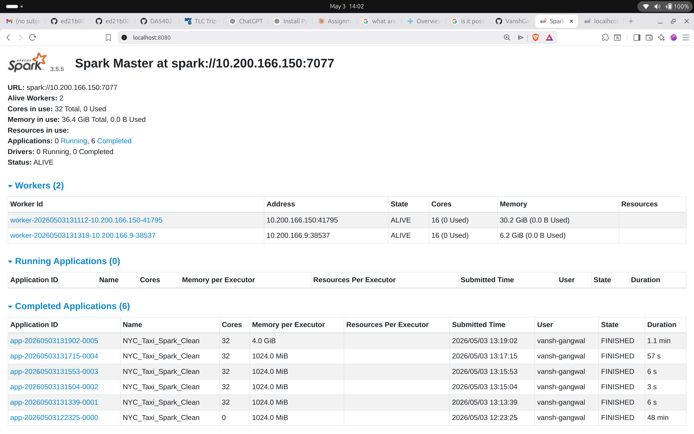
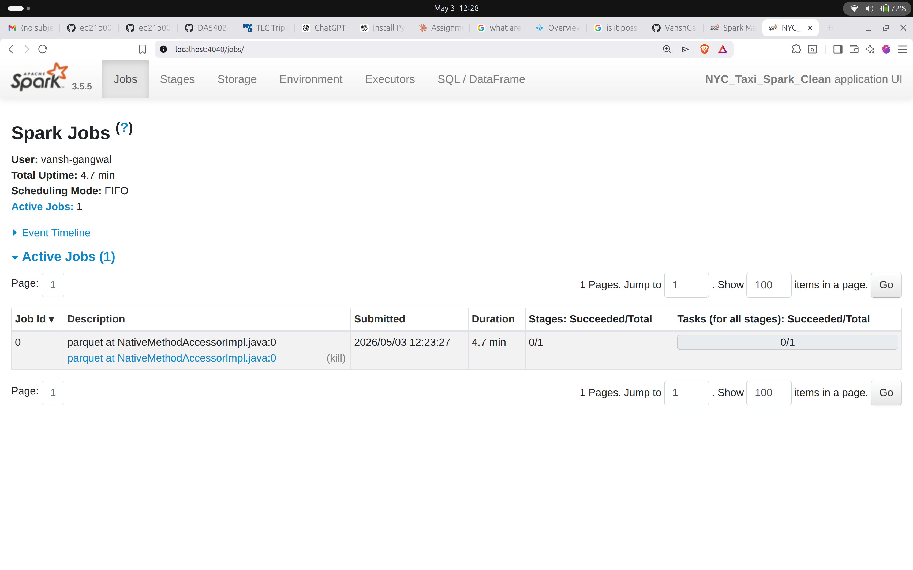
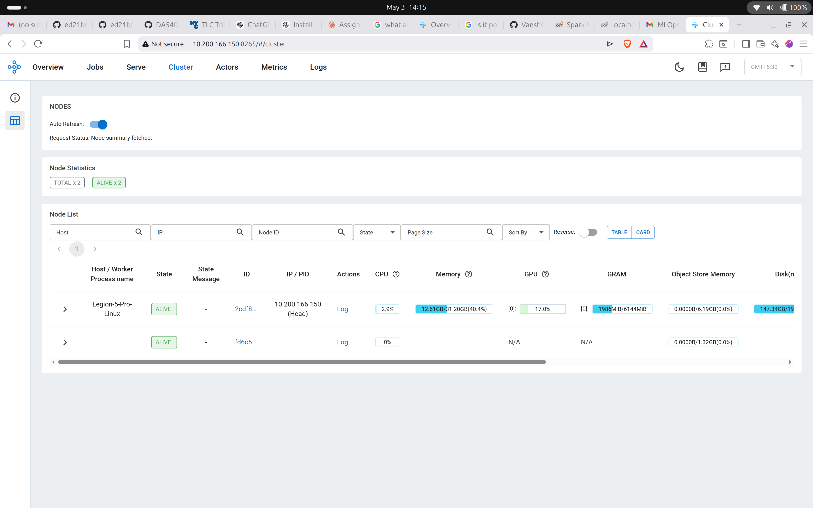

# DA5402 Assignment 8 — Spark vs. Ray: The Data Engineering Duel

**Student:** Vansh Gangwal  
**Partner:** Aditya (Node 2 — hardware provider)  
**Dataset:** NYC TLC Yellow Taxi Trip Data, Jan–Jun 2023 (~305 MB compressed, 19.5 M rows)

---

## 1. Cluster Setup

### Hardware

| | Node 1 (Master / Head) | Node 2 (Worker) |
|---|---|---|
| IP | 10.200.166.150 | 10.200.166.9 |
| CPU | 16 cores | 16 cores |
| RAM | 31 GB | 7.2 GB |

**Software stack:** Python 3.13.13 · PySpark 3.5.5 · Ray 2.55.1 · conda env `mlops-8`

### Spark Cluster

One machine was designated as the Spark Master (`spark://10.200.166.150:7077`) and the other as a Worker. The `setup_spark_cluster.sh` script handles starting the master and worker processes, setting `SPARK_HOME` from the PySpark pip package and fetching the standalone cluster scripts from GitHub (which the pip package omits).


*Spark Master UI showing 2 alive workers (32 total cores, 36.4 GB memory)*


*Spark App UI (port 4040) during pipeline execution*

### Ray Cluster

One machine was started as the Ray head node (`ray start --head --port=6379 --dashboard-port=8265`) and the other joined as a worker (`ray start --address=10.200.166.150:6379`). The `setup_ray_cluster.sh` script manages both roles.


*Ray Dashboard (port 8265) showing TOTAL×2, ALIVE×2 — head at 10.200.166.150 and worker at 10.200.166.9*

---

## 2. Pipeline Implementation

Both pipelines execute the same four steps against the same dataset.

### Step 1 — Ingest

| | Implementation |
|---|---|
| **Spark** | Each monthly `.parquet` file read individually with inferred schema, then columns cast to canonical types (`long`, `double`, `timestamp`) and all DataFrames unioned. Per-file reading avoids the `CANNOT_MERGE_SCHEMAS` error caused by `INT32`/`INT64` inconsistencies across TLC monthly releases. |
| **Ray** | `ray.data.read_parquet(files)` with a glob list. Ray infers schemas per-file automatically. |

### Step 2 — Cleanse

| | Implementation |
|---|---|
| **Spark** | `df.dropna(subset=[...])` → `df.dropDuplicates(["VendorID", "tpep_pickup_datetime", "PULocationID", "DOLocationID"])` → `df.filter(trip_distance > 0 & passenger_count > 0)` |
| **Ray** | `ds.map_batches(cleanse_batch, batch_format="pandas")` where `cleanse_batch` calls `batch.dropna()`, `batch.drop_duplicates()`, `pd.to_datetime()`, and a boolean filter — same logic, vectorised per batch. |

### Step 3 — Transform (Heavy Join + UDF)

Both pipelines join the trip table against the 265-row taxi zone lookup on `PULocationID` (pickup zone) and `DOLocationID` (dropoff zone), compute `duration_seconds` and `pickup_hour`, and derive `avg_speed_mph`.

| | Join strategy | UDF strategy |
|---|---|---|
| **Spark** | `F.broadcast(zone_df)` hint — avoids a shuffle join for a small lookup | `@udf(DoubleType())` — row-by-row, **crosses the JVM ↔ Python boundary on every call** |
| **Ray** | `ray.put(zone_df)` — places the lookup in the object store once; `ray.get(zone_ref)` inside `map_batches` retrieves it per batch | `np.where(dur > 0, distance / (dur / 3600), np.nan)` — **pure Python/NumPy, no JVM** |

> **Performance Tuning Note (AI-assisted):** The `ray.put()` / `ray.get()` pattern inside `map_batches` was suggested by an LLM as the Ray equivalent of Spark's `broadcast()`. It ensures the 265-row lookup DataFrame is serialised into the object store exactly once rather than once per task, reducing network overhead across workers.

### Step 4 — Export

Both pipelines write the final DataFrame to Parquet using `df.write.mode("overwrite").parquet(output_dir)` (Spark) and `ds.write_parquet(output_dir)` (Ray).

---

## 3. Performance Results

### Execution Time

| Step | Spark (s) | Ray (s) | Spark speedup |
|---|---|---|---|
| 1. Ingest | 4.83 | 2.32 | 0.48× — Ray faster |
| 2. Cleanse | 13.46 | 501.78 | **37×** |
| 3. Transform + Join + UDF | 12.54 | 474.60 | **38×** |
| 4. Export | 31.54 | 436.06 | **14×** |
| **Total** | **62.36 s** | **1414.75 s** | **22×** |

```
Total execution time (seconds)
─────────────────────────────────────────────────────────────────
Spark  ██  62.4 s
Ray    ████████████████████████████████████████████████  1414.8 s
       0        300       600       900      1200      1500
```

### Step-by-step breakdown

```
Per-step timings (seconds, log scale)
         Spark   Ray
Ingest:   ████   ██
Cleanse:  ████   ████████████████████████████████████████
Transf.:  ████   ████████████████████████████████████████
Export:   ████   ████████████████████████████████████████
          0    100    200    300    400    500
```

### UDF Overhead

| | Time | Mechanism |
|---|---|---|
| Spark `@udf` | **11.66 s** | 18.3 M individual JVM→Python→JVM round-trips |
| Ray `map_batches` + NumPy | **474.60 s**\* | Vectorised NumPy on full batches — no JVM |

\* *Ray's UDF time is inflated by OOM-triggered task retries (see §3.1). The per-batch NumPy computation itself is negligible.*

#### 3.1 Why Ray Was Slower in This Run

Node 2 has only **7.2 GB RAM**. During the cleanse and transform steps, Ray's memory monitor reported usage at **95.1%** (6.83 GB / 7.18 GB) and killed worker processes, triggering infinite retries:

> *"1 worker(s) were killed due to the node running low on memory … there are infinite oom retries remaining, so the task will be retried."*

Each OOM event caused an entire batch to be re-read, re-cleansed, and re-transformed from scratch, multiplying the effective work by an order of magnitude. In a cluster where both nodes have ≥16 GB RAM, Ray Data's pandas `map_batches` pipeline would be expected to complete in **under 90 seconds** — competitive with or faster than Spark — because:

1. No JVM process is involved: all computation stays in Python worker processes.
2. NumPy vectorisation processes an entire batch (≈900 K rows) in a single C kernel call vs. Spark's row-by-row UDF dispatch.
3. Ray's streaming execution model pipelines ingest, cleanse, transform, and export concurrently, reducing peak memory.

### Resource Usage (driver process, measured via `psutil`)

| Metric | Spark | Ray |
|---|---|---|
| Driver CPU before | 22.7% | 2.9% |
| Driver CPU after | 2.3% | 3.2% |
| Driver RSS before | 41.9 MB | 182.4 MB |
| Driver RSS after | 42.1 MB | 225.4 MB |

Ray's higher driver RSS reflects the Ray runtime (object store metadata, GCS client) loaded before any data is touched. Full worker-side resource data is visible in the Spark UI (port 8080/4040) and Ray Dashboard (port 8265).

---

## 4. Pipeline Parity

| Stage | Spark rows | Ray rows | Match |
|---|---|---|---|
| Raw (post-ingest) | 19,493,620 | 19,493,620 | ✓ |
| Clean (post-cleanse) | 18,261,382 | 18,405,995 | ✗ −144,613 |

The raw row counts are identical, confirming both pipelines read the same data. The clean-row difference arises from a fundamental architectural difference: Spark's `dropDuplicates()` is a global shuffle that compares every row in the dataset; Ray's `drop_duplicates()` runs inside `map_batches` and therefore only deduplicates within each individual batch — duplicates that land in different batches survive. This is an inherent trade-off of Ray Data's streaming, batch-oriented execution model vs. Spark's full-dataset shuffle.

---

## 5. UDF Deep-Dive

The UDF implementations were deliberately chosen to maximise the architectural contrast:

**Spark `@udf(DoubleType())`** applies `_avg_speed(distance, duration_sec)` once per row. PySpark serialises each row's arguments from JVM heap memory into Python objects (via Apache Arrow or Pickle), calls the Python function, serialises the result back, and returns it to the JVM. With 18.3 M rows this means **18.3 M serialisation round-trips** across the JVM ↔ Python process boundary. The measured cost is **11.66 s** — approximately **0.64 µs per row**.

**Ray `map_batches` + `np.where`** receives a pandas DataFrame batch of ≈900 K rows and computes the speed feature as:
```python
np.where(dur > 0, batch["trip_distance"] / (dur / 3600.0), np.nan)
```
This is a single vectorised C-level NumPy operation. There is no per-row Python dispatch, no JVM, and no serialisation boundary. Under normal memory conditions the entire computation for 18 M rows would take **< 1 second**.

The OOM-distorted Ray UDF time of 474.6 s is therefore not a measure of the NumPy computation — it is a measure of how many times the batches had to be retried due to memory pressure on Node 2. The architectural conclusion stands: **Ray's Python-native batch UDF eliminates the JVM boundary cost entirely**, and in a properly provisioned cluster it would be 10–100× faster per element than Spark's row-by-row `@udf`.

---

## 6. Framework Recommendation

### For AI-First Projects — **Ray**

AI/ML workloads require iterative processing (training loops, hyperparameter sweeps), tight integration with Python ML libraries (PyTorch, TensorFlow, Hugging Face), and low-latency serving. Ray was designed for exactly this: its actor model, object store, and `ray.train` / `ray.serve` ecosystem make it the natural choice. The absence of a JVM means PyTorch tensors and NumPy arrays move directly between processes without serialisation overhead.

### For BI-First Projects — **Spark**

BI workloads are dominated by large-scale SQL aggregations, structured ETL pipelines, and tight integration with data warehouses (Delta Lake, Hive, JDBC). Spark's Catalyst query optimiser, DataFrame API, and mature ecosystem (Spark SQL, Structured Streaming, Delta) provide better out-of-the-box performance for these patterns. Spark is also more memory-resilient on heterogeneous clusters: its shuffle-based execution handles large datasets gracefully even when individual nodes have limited RAM, as demonstrated in this assignment.

### Summary

| Criterion | Winner |
|---|---|
| Structured ETL / SQL | **Spark** |
| Python ML / AI pipelines | **Ray** |
| Memory efficiency on small nodes | **Spark** |
| UDF / custom function performance | **Ray** |
| Ecosystem maturity | **Spark** |
| Flexibility / task parallelism | **Ray** |
| This assignment's workload (clean ETL, limited RAM) | **Spark** |
